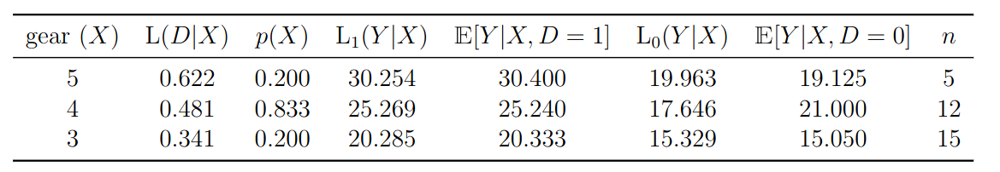
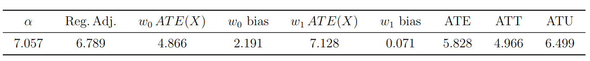

# Introduction


$$\newcommand{\E}{\mathbb{E}}
\newcommand{\E}{\mathbb{E}}
\newcommand{\var}{\mathrm{var}}
\newcommand{\cov}{\mathrm{cov}}
\newcommand{\Var}{\mathrm{var}}
\newcommand{\Cov}{\mathrm{cov}}
\newcommand{\Corr}{\mathrm{corr}}
\newcommand{\corr}{\mathrm{corr}}
\newcommand{\L}{\mathrm{L}}
\renewcommand{\P}{\mathrm{P}}
\newcommand{\independent}{{\perp\!\!\!\perp}}$$


<style type="text/css">

border-top: 80px solid #BA0C2F;

.inverse {
  background-color: #BA0C2F;
}

.alert {
    font-weight:bold; 
    color: #BA0C2F;
}

.alert-blue {
    font-weight: bold;
    color: blue;
}

.remark-slide-content {
    font-size: 23px;
    padding: 1em 4em 1em 4em;
}

.highlight-red {
 background-color:red;
 padding:0.1em 0.2em;
}

.assumption-box {
    background-color: rgba(222,222,222,.5);
    font-size: x-large;
    padding: 10px; 
    border: 10px solid lightgray; 
    margin: 10px;
}

.assumption-title {
    font-size: x-large;
    font-weight: bold;
    display: block;
    margin: 10px;
    text-decoration: underline;
    color: #BA0C2F;
}
</style>


```{r echo=FALSE}
step_by_step_eq <- function(eqlist, before="", after="", title=" ") {
  
  # drop slide pauses in before content
  before_inner <- gsub("--", "", before)
  
  for (i in 2:length(eqlist)) {
    eqlist[i] <- paste0(eqlist[i-1],"\\\\\n",eqlist[i])
  }

  out <- ""
  for (i in 1:length(eqlist)) {
    if (i > 1) out <- paste0(out, "count:false", "\n")
    out <- paste0(out, "# ", title, "\n") # print title
    # print before content
    if (i == 1) out <- paste0(out, before, "\n") else out <- paste0(out, before_inner, "\n") 
    out <- paste0(out, "$$\n\\begin{aligned}\n",eqlist[[i]],"\n\\end{aligned}\n$$\n\n") # print equation
    if (i < length(eqlist)) out <- paste0(out, "---\n\n")
  }
  out <- paste0(out, after, "\n") # print after content
  out <- paste0(out, "---\n")
  cat(out)
}
```

We consider a simple, observational setting where a researcher is interested in understanding the <span class="alert">causal effect of a binary treatment</span> under the assumption of <span class="alert">unconfoundedness</span>

--

$$(Y(1),Y(0)) \independent D | X$$

--

In this setting, (arguably) the natural target parameter is
\begin{align*}
  ATE &:= \E[Y(1) - Y(0)] = \E\Big[ ATE(X) \Big] 
\end{align*}

--

where
\begin{align*}
  ATE(X) := \E[Y(1)-Y(0)|X] = \E[Y|X,D=1] - \E[Y|X,D=0]
\end{align*}

---

# Introduction

By far the most commonly used estimation strategy in this setting is to estimate the following regression

$$Y_i = \alpha D_i + X_i'\beta + e_i$$

--

and $\alpha$ is interpreted as the causal effect of the treatment (or, under <span class="alert">treatment effect heterogeneity</span>, as (hopefully) a weighted average of conditional average treatment effects)

---

# Previous Work

In particular, Angrist (1998) and Aronow and Samii (2016) provide conditions under which

$$\alpha = \E\left[ \frac{p(X)(1-p(X))}{\E[p(X)(1-p(X))]} ATE(X) \right]$$

where the first term are "weights" and $ATE(X) := \E[Y(1) - Y(0) | X]$ is the conditional average treatment effect.

--

These weights have the following properties:

1. Mean 1

2. Guaranteed to be non-negative (Blandhol et al. (2022) call this "weakly causal")

3. "Inherited" from the estimation strategy (notice that $p(X)(1-p(X))$ is the conditional variance of the treatment $\implies$ more weight on $ATE(X)$ when this variance is high)

---

name: angrist

# But...

To derive this result, previous papers invoke the assumption that the propensity score is linear in covariates, that is,

$$p(X) = \L(D|X)$$

where $\L(D|X)$ is the (population) linear projection of $D$ on $X$, i.e.,

$$\L(D|X) := X'\E[XX']^{-1} \E[XD] = X'\gamma$$

[[Sketch Proof](#sketch-proof)]

---

name: linear-pscore

# Linearity of the Propensity Score

And it's not clear whether or not this is a reasonable condition:

--

* Angrist (1998) / MHE talks about the case where all covariates are discrete (fairly common in empirical work) and model is fully saturated in covariates (less common)

    - This is also a case where it would be straightforward to just recover $ATE$ directly rather than being content with the weighted average.
    
--

* Ishimaru (2021), Caetano, Callaway, Payne, Rodrigues (2022), Goldsmith-Pinkham, Hull, and Kolesar (2022) argue that (by construction) it is difficult for the propensity score to be linear in settings such as RD and DID.

    * [[DID Example](#did-example)]

---
# Current Paper 

<span class="alert">Our question:</span> Are there alternative conditions that can "rationalize" using the regression to estimate a weighted average of conditional average treatment effects?

* while allowing for treatment effect heterogeneity

--

<span class="alert">Some high-level thoughts:</span>

* High-leve thought 1: It seems strange that the key condition for interpreting $\alpha$ concern the propensity score...why not other linearity conditions on the outcome?


---

#  High-level thought 2: Double Robustness

There is large literature in statistics/econometrics about double robustness (Robins, Rotnitzky, and Zhao (1994), Słoczyński and Wooldridge (2018), many others)

--

A typical result in this literature is that one can consistently estimate the $ATE$ (or $ATT$, etc.) if *either*:

(1) A model for the propensity score is correctly specified

(2) Outcome regression models are correctly specified

--

For condition (2), a leading example is that: 

* Linearity of model for untreated potential outcomes: $\E[Y|X,D=0] = \L_0(Y|X) := X'\beta_0$.
    
* Linearity of model for treated potential outcomes: $\E[Y|X,D=1] = \L_1(Y|X) := X'\beta_1$

--

Is this sort of condition relevant for interpreting $\alpha$?

---

# Thought 3: Implicit Weighting / Outcome Modeling

A number of papers have also noted that a different estimation strategies often *implicitly* "balance" or estimate an outcome model

--

<span class="alert">Examples:</span>

* Regression - Chattopadhyay and Zubizarreta (2022) interpret regressions like we consider through the lens of re-weighting observations and derive a number of interesting properties

--

* Regression adjustment - Kline (2011) shows that regression adjustment estimators implicitly fit an inverse linear propensity score model

--

* Entropy balancing - Zhao and Percival (2016) show that entropy balancing implicitly estimates an outcome regression model

--

These results imply extra (and not obvious) conditions under which these estimation strategies can recover causal effect parameters.

---

# Related Work

Besides the work mentioned above that assumes linearity of the propensity score (see also Słoczyński (2020))

--

Several recent papers have related results that provide related results in different contexts:

* Blandhol, Bonney, Mogstad, Torgovitsky (2022) -- Two stage least squares

* Goldsmith-Pinkham, Hull, Kolesar (2022) -- Multiple treatments

* Caetano, et al. (2022) -- Difference-in-differences

* Ishimura (2022) -- Continuous treatment

---

# Outline

<br> <br> <br>

1. Two decompositions of $\alpha$

2. Two main results on causally interpreting $\alpha$

3. Some extensions / discussion

4. Empirical Exercise

---

# Decomposition 1

$\alpha$, the regression coefficient on $D$, can be decomposed as follows:
\begin{align*}
    \alpha = \E\Big[ w_0(D,X) (\L_1(Y|X) - \L_0(Y|X)) \Big]
\end{align*}
where $w_0(D,X)$ are weights that are given by
\begin{align*}
    w_0(D,X) = \frac{D(1-\L(D|X))} {\E\Big[(D-\L(D|X))^2\Big]}
\end{align*}

--

<span class="alert">Properties:</span>

* $\E[w(D,X)] = 1$ 

* It is possible that $w_0(D,X)$ can be negative for some values of $D$ and $X$.

* Since all of the terms in this decomposition are linear projections, it's straightforward to compute all terms here

---

# Decomposition 2

$\alpha$, the regression coefficient on $D$, can be decomposed as
\begin{align*}
    \alpha &= \E\left[w_0(D,X) \Big( \E[Y|X,D=1] - \E[Y|X,D=0] \Big) \right] \\
    & + \E\left[w_0(D,X)\Big(\E[Y|X,D=0] - \L_0(Y|X) \Big) \right] 
\end{align*}

--

* It's not so easy to compute all the terms in this decomposition (particularly the conditional expectations)

--

* This is a useful intermediate step for explaining our main results next

--

* Under unconfoundedness, the first term is going to be a weighted average of $ATE(X)$

--

* The second term is going to be a nuisance term (a kind of misspecification or nonlinearity bias term) that we would like to be equal to 0


---

# Main Result 1

Under (i) unconfoundedness, (ii) overlap, and *either* (iii) linearity of the propensity score... $p(X) = \L(D|X)$ *or* (iv) linearity of model for untreated potential outcomes... $\E[Y|X,D=0] = \L_0(Y|X)$, then 

\begin{align*}
    \alpha &= \E\left[w_0(D,X) ATE(X) \right]
\end{align*}

--

This is closely related to results in Goldsmith-Pinkham et al. (2022) (in particular) and also results in Blandhol et al. (2022) and Caetano, et al. (2022).

--

<span class="alert">Additional Comments:</span>

* The weights are guaranteed to be non-negative under linearity of the propensity score

--

* Under linearity of the model for untreated potential outcomes, the weights are estimable (and one can check for negative weights by checking if $\L(D|X) \leq 1$ uniformly among the treated group).

--

* Interestingly (surprisingly??), condition (iv) required *only* linearity of $\E[Y|X,D=0]$ but not necessarily linearity of $\E[Y|X,D=1]$.

---

# Main Result 2

Alternatively, using closely related arguments, you can additionally show the following result:

--

Under (i) unconfoundedness, (ii) overlap, and *either* (iii) linearity of the propensity score... $p(X) = \L(D|X)$ *or* (iv) <span class="alert">linearity of model for treated potential outcomes... $\E[Y|X,D=1] = \L_1(Y|X)$</span>, then 

\begin{align*}
    \alpha &= \E\left[w_1(D,X) ATE(X) \right]
\end{align*}
where 
\begin{align*}
    w_1(D,X) = \frac{(1-D)\L(D|X)} {\E\Big[(D-\L(D|X))^2\Big]}
\end{align*}

---

# Main Results 2 (cont'd)

<span class="alert">Additional Comments:</span>

* In general, $w_1(D,X) \neq w_0(D,X)$ ... even $\E[w_1(D,X) | X] \neq \E[w_0(D,X)|X)]$ in general (implying that the results, in general, put different weights on $ATE(X)$.)

--

* A sufficient condition for the weights to be non-negative is that $\L(D|X) \geq 0$ uniformly among the untreated group

--

* A sufficient condition for the weights to be equal is that $p(X) = \L(D|X)$.

--

* If $p(X) \neq \L(D|X)$, and $\E[Y|X,D=d] = \L_d(Y|X)$ for *both* $d=1$ and $d=0$, then $\alpha$ is equal to two different weighted averages of $ATE(X)$ (in principle, both could have all positive weights)

---

# Discussion

<span class="alert">About negative weights:</span>

--

* Much of the literature (and empirical work) has emphasized the problem of negative weights that are possible here (and often possible in under-specified regression models).

    * Still...in practice, negative weights are often small in magnitude, and there is much more variation in the positive weights

    * And you can come up with weighting schemes where the weights are all positive but are still very poor weighting schemes

--

* The above results make it easy to to check (under our assumptions) whether or not there are negative weights.

--

* This discussion matters more when there is more treatment effect heterogeneity

---

# Discussion

<span class="alert">Possible advantages of regressions?</span>

One of the strange things about the "interpreting regressions" literature (in my view) is that the imposed conditions to interpret the regression coefficient (as a weighted average) often would allow you to just directly target causal effect parameters directly:

--

* <span class="alert">Ex.</span> If you know, $p(X) = \L(D|X)$, then you could directly target $ATE$ using propensity score re-weighting

--

* <span class="alert">Ex.</span> If you know, *either* (i) $p(X) = \L(D|X)$ *or* (ii) $\E[Y|X,D=1] = \L_1(Y|X)$ *and* $\E[Y|X,D=0] = \L_0(Y|X)$, then you could use doubly robust approaches to directly target $ATE$

--

However, our results imply that you could use the regression to recover a weighted average of $ATE(X)$ if *any* of (i) $p(X) = \L(D|X)$ *or* (ii) $E[Y|X,D=1] = \L_1(Y|X)$ *or* (iii) $\E[Y|X,D=0] = \L_0(Y|X)$

* Seems strange...but this is what we are currently thinking about

---

# ATT Version

Can show: under $Y(0) \independent D | X$, if (i) $p(X) = \L(D|X)$ or (ii) $\E[Y|X,D=0] = \L_0(Y|X)$, then 
\begin{align*}
  \alpha = \E\left[ \frac{(1-\L(D|X))}{\E[(1-\L(D|X))|D=1]} ATT(X) \Big| D=1 \right]
\end{align*}

--

Alternatively, if (a) $p(X) = \L(D|X)$ or (b) $\E[Y|X,D=1] = \L_1(Y|X)$, then
\begin{align*}
  \alpha = \E\left[ \frac{\frac{1-p(X)}{p(X)}\L(D|X)}{\E\left[\frac{1-p(X)}{p(X)}\L(D|X) \Big|D=1\right]} ATT(X) \Big| D=1 \right]
\end{align*}

--

<span class="alert">Comments:</span>

* If $p(X) = \L(D|X)$, then the weights in the two expressions are equal (but not in general), and the weights are guaranteed to be positive

---

count: false

# ATT Version

Can show: under $Y(0) \independent D | X$, if (i) $p(X) = \L(D|X)$ or (ii) $\E[Y|X,D=0] = \L_0(Y|X)$, then 
\begin{align*}
  \alpha = \E\left[ \frac{(1-\L(D|X))}{\E[(1-\L(D|X))|D=1]} ATT(X) \Big| D=1 \right]
\end{align*}

Alternatively, if (a) $p(X) = \L(D|X)$ or (b) $\E[Y|X,D=1] = \L_1(Y|X)$, then
\begin{align*}
  \alpha = \E\left[ \frac{\frac{1-p(X)}{p(X)}\L(D|X)}{\E\left[\frac{1-p(X)}{p(X)}\L(D|X) \Big|D=1\right]} ATT(X) \Big| D=1 \right]
\end{align*}

<span class="alert">Comments:</span>

* The second result is (perhaps) surprising because, typically, in order to recover $ATT$, you would need either condition (a) or to be able to model untreated potential outcomes (as you cannot directly see these for the treated group).

--

* Can derive similar results for $ATU$

---

# Empirical Example

How much do the issues that we have been talking about above matter in practice?

--

Address this with an (extremely) small scale application.  First, a couple of issues:

* All of the results above are at the population level

* Conditional expectations / propensity score hard to estimate nonparametrically in realistic applications

---

# Empirical Example 

<span class="alert">Our idea 1: </span> Treat data *as if* it is the data generating process.

<span class="alert">Our idea 2: </span> Punt on unconfoundedness "really" holding, but instead target 
\begin{align*}
  \theta = \E\Big[ \E[Y|X,D=1] - \E[Y|X,D=0] \Big]
\end{align*}

--

* $\theta = ATE$ under unconfoundedness, but can still illustrate the issues discussed above even if unconfoundedness doesn't hold

--

* We choose $X$ to be of the lowest possible dimension so that $p(X)$ and $\E[Y|X,D=d]$ are not linear by construction

---

# mtcars Data

```{r echo=FALSE}
mtcars
```

---

# Setup

We will be interested in:

* $Y$ : `mpg` - a car's miles per gallon

* $D$ : `vs` - shape of the engine ( $D=1$ for straight engines, $D=0$ for V-shaped engines)

* $X$ : `gear` the number of gears that the car has 

  * only takes values 3, 4, or 5 here

---

# "Data Generating Process"



--

<span class="alert">Some things to notice</span>

* $p(X)$ is not close to being linear

* $\E[Y|X,D=0]$ not close to being linear either

* But $\E[Y|X,D=1]$ is *very close* to being linear

---

# Regression Components


<span class="alert">Notes:</span>

* There is substantial variation in $ATE(X)$

  * $\implies$ the weighting scheme matters tremendously
  
---

count: false

# Regression Components


<span class="alert">Notes:</span>

* $ATE$ weights come from $\P(X=x)$, i.e., the fraction of the population where $X=x$.

* Note the $w_1$ and $w_0$ weights come from calculating $\E[w_d(D,X)|X]$ and multiplying by $\P(X=x)$ (this gives the "fraction" of weight for each $ATE(X)$.)

---

count: false

# Regression Components


<span class="alert">Notes:</span>

* $p(X)$ weights are the "variance" weights that occur under the assumption of linearity of the propensity score. It's mainly a coincidence that the $p(X)$ weights are close to the $ATE$ weights (there happens to be little variation in $p(X)(1-p(X))$ across different values of $X$)

---

count: false

# Regression Components


<span class="alert">Notes:</span>
  
* There are no negative weights in any cases but the weights are much different from each other (mainly due to the highly nonlinear propensity score)

---

# Treatment Effects



<span class="alert">Notes:</span>

* $\alpha$ is substantially larger than the $ATE$ (this is a little more than 20% larger)

* $\alpha$ is also outside the "convex hull" of $ATT$ and $ATU$

---

# Treatment Effects


<span class="alert">Notes:</span>

* The columns labeled $w_d \, ATE(X)$ multiply the two regression weights onto the conditional $ATE$'s

--

* Because $p(X)$ is not linear, these two quantities are not very close to each other.  

--

* Because $\E[Y|X,D=0]$ is not linear either, $w_1 \, ATE(X)$ is not close to $\alpha$.  

  * The difference is a misspecification bias ("level-dependence") that is hard to interpret.  It is about 45% as large as the "interpretable" weighted average of conditional $ATT$'s.

--
  
* Because $\E[Y|X,D=1]$ is close to being linear, $w_0 \, ATE(X)$ is close to $\alpha$.  That provides a rationalization to interpreting $\alpha$ as a weighted average of conditional $ATT$'s.

---


# Discussion

<span class="alert">Caveats to our "empirical exercise"</span>

* There's a lot of treatment effect heterogeneity here.  It's possible that this is an artifact of using a very small dataset (could be confusing "noise" with heterogeneous effects).

--

* On the other hand, presumably, more likely that linearity is close to holding in this very small scale application

--

* It "matters" that only one of the three linearity conditions is required here

  * In practice, it is hard to see how a researcher would know which of the three linearity conditions was more likely to hold.  

--

* Finally, there are no negative weights here $\implies$ we can interpret as being "weakly causal"

  * Despite this: $\alpha$ is still far from the ATE

---

# Conclusion

* We provide some new conditions under which the coefficient on a binary treatment can be interpreted as being "weakly causal"

--

* We find it especially interesting that this result can hold under *any* of the three linearity conditions discussed above

--

* This is a brand new project for us, so we greatly appreciate any feedback

---


count:false
class: inverse, middle, center

# Thanks!

---

count: false
name: sketch-proof


```{r echo=FALSE, results="asis"}
eqlist <- list("\\small \\alpha & \\small = \\E\\left[ \\frac{(D-\\L(D|X))}{\\E[(D-\\L(D|X))^2]}Y\\right] \\hspace{500pt}",
               "& \\small = \\E\\left[ \\frac{(1-\\L(D|X))}{\\E[(D-\\L(D|X))^2]}Y\\Big| D=1 \\right]p - \\E\\left[ \\frac{\\L(D|X))}{\\E[(D-\\L(D|X))^2]}Y\\Big| D=0 \\right](1-p)",
               "& \\small = \\E\\left[ \\frac{(1-\\L(D|X))}{\\E[(D-\\L(D|X))^2]}\\E[Y|X,D=1]\\Big| D=1 \\right]p - \\E\\left[ \\frac{\\L(D|X))}{\\E[(D-\\L(D|X))^2]}\\E[Y|X,D=0]\\Big| D=0 \\right] (1-p)",
               "& \\small = \\E\\left[ \\frac{p(X) (1-\\L(D|X))}{\\E[(D-\\L(D|X))^2]}\\E[Y|X,D=1] \\right] - \\E\\left[ \\frac{(1-p(X))\\L(D|X))}{\\E[(D-\\L(D|X))^2]}\\E[Y|X,D=0] \\right]",
               "& \\small = \\E\\left[ \\frac{p(X) (1-\\L(D|X))}{\\E[(D-\\L(D|X))^2]}\\Big(\\E[Y|X,D=1]-\\E[Y|X,D=0]\\Big) \\right] + \\underbrace{\\E\\left[ \\frac{(p(X)-\\L(D|X))}{\\E[(D-\\L(D|X))^2]}\\E[Y|X,D=0] \\right]}")

after <- "

--

* The underlined term is undesirable.  

* Blandhol et al. (2022) refer to this type of term as \"level-dependence\"

* It is equal to 0 if $p(X) = \\L(D|X)$. &nbsp; &nbsp; &nbsp; &nbsp; &nbsp; [[Back](#angrist)]"

step_by_step_eq(eqlist, title="Sketch Proof", 
                after=after)
```


count: false
name: did-example

# DID Example

Suppose you have two time periods and run the following regression in first differences:

$$\Delta Y_{it} = \alpha D_{it} + \Delta X_{it}'\beta + \Delta e_{it}$$

In this setting, the equivalent condition to linearity of the propensity score is that

$$p(\Delta X) = \L(D|\Delta X)$$
But the "leading" case where this holds (discrete/saturated) no longer holds

* E.g., suppose $X_{it}$ is binary

  * The propensity score is no longer linear by construction ( $\Delta X$ can take 3 possible values (-1, 0, 1), but there are 4 possible combinations of $X_{t-1}$ and $X_t$).

[[Back](#linear-pscore)]

